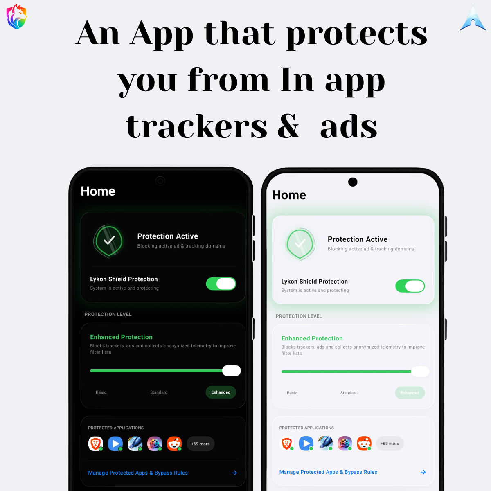

# Lykon Shield

  

Lykon Shield is a local VPN-based ad-blocker and privacy guard for Android. It runs a local DNS sinkhole using Android's `VpnService` API to intercept and drop requests to known ad and tracking domains — entirely on-device, with no external servers, no cloud relay, and no telemetry.

In the adblock.turtlecute.org tracker test, Lykon Shield blocked **129/133 trackers (97%)** compared to Brave Shields' 84/133 (63%).

## Features

- **Local DNS Sinkhole** — Blocks ads and trackers without routing traffic through any external proxy or server.
- **System-Wide Protection** — Covers all apps on the device, not just the browser.
- **Bypass App Selection** — Whitelist specific apps to skip VPN protection entirely.
- **On-Device Blocklists** — Filter lists are stored and updated locally. No cloud dependency.
- **Detailed Logs** — See exactly what is being blocked in real time.
- **Premium UI** — Backdrop-based glassmorphism, AGSL custom shaders, and interactive liquid glass layouts.

## Known Limitations

- **Unified CDN Ads** — Some major audio and video streaming services serve both media content and ads from the same CDN domains. Blocking the domain breaks playback entirely. Visual ads and trackers on these platforms are still blocked; audio/video in-stream ads may slip through. See the [FAQ](FAQ.md) for a full technical explanation.
- **Single VPN Slot** — Android allows only one active VPN at a time. Lykon Shield will pause if you connect to an external VPN.
- **No SSL Inspection** — Lykon Shield does not perform MITM decryption. This is by design.

## FAQ

For questions about how it works, privacy, battery usage, and limitations — see [FAQ.md](FAQ.md).

## Download

Lykon Shield is currently in Alpha. Get the latest release from the [Releases](https://github.com/ProjectArcade/Acrade-LykonShield-Android/releases/) page.

## Ownership & Licensing

- **Organization**: ProjectArcade  
- **Developer**: Abhinav Thakur  
- **License**: Licensed under the [GNU General Public License v3.0 (GPL-3.0)](LICENSE).